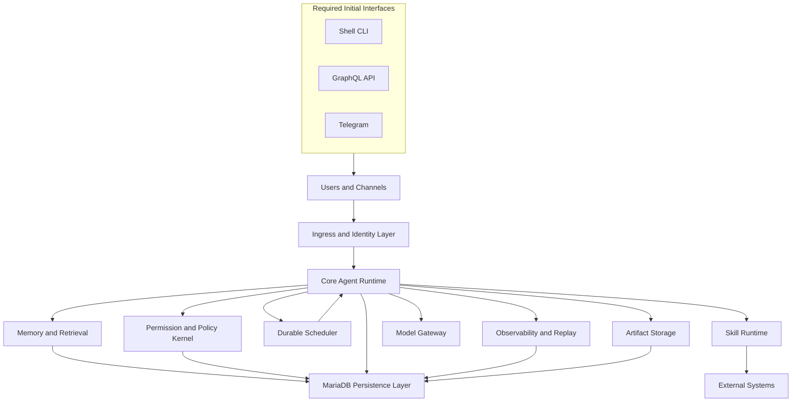

# System Overview Diagram

This diagram shows the major subsystems and their relationships. Detailed subsystem diagrams are provided in separate files.

```mermaid
flowchart TB
  Users["Users and Channels"] --> Ingress["Ingress and Identity Layer"]
  Ingress --> Runtime["Core Agent Runtime"]

  Runtime --> Security["Permission and Policy Kernel"]
  Runtime --> Skills["Skill Runtime"]
  Runtime --> Scheduler["Durable Scheduler"]
  Runtime --> Memory["Memory and Retrieval"]
  Runtime --> Models["Model Gateway"]

  Skills --> ExternalSystems["External Systems"]
  Scheduler --> Runtime
  Memory --> Persistence["MariaDB Persistence Layer"]
  Security --> Persistence
  Runtime --> Persistence

  Runtime --> Observability["Observability and Replay"]
  Observability --> Persistence

  Runtime --> Artifacts["Artifact Storage"]
  Artifacts --> Persistence

  subgraph Interfaces["Required Initial Interfaces"]
    Shell["Shell CLI"]
    GraphQL["GraphQL API"]
    Telegram["Telegram"]
  end

  Interfaces --> Users
```
