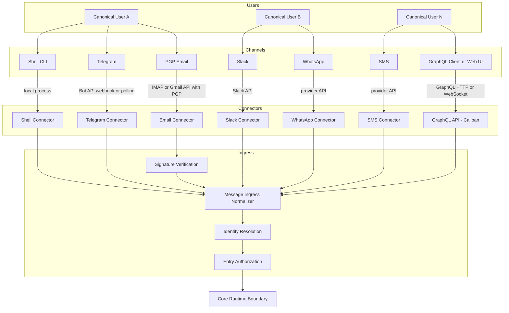

# Users, Channels, Ingress, and Identity

```mermaid
flowchart TB
  subgraph Users
    UserA["Canonical User A"]
    UserB["Canonical User B"]
    UserN["Canonical User N"]
  end

  subgraph Channels
    Shell["Shell CLI"]
    GraphQLClient["GraphQL Client or Web UI"]
    Telegram["Telegram"]
    Slack["Slack"]
    Email["PGP Email"]
    WhatsApp["WhatsApp"]
    SMS["SMS"]
  end

  UserA --> Shell
  UserA --> Telegram
  UserA --> Email
  UserB --> Slack
  UserB --> WhatsApp
  UserN --> SMS
  UserN --> GraphQLClient

  subgraph Connectors
    ShellConnector["Shell Connector"]
    GraphQLApi["GraphQL API - Caliban"]
    TelegramConnector["Telegram Connector"]
    SlackConnector["Slack Connector"]
    EmailConnector["Email Connector"]
    WhatsAppConnector["WhatsApp Connector"]
    SmsConnector["SMS Connector"]
  end

  Shell -->|"local process"| ShellConnector
  GraphQLClient -->|"GraphQL HTTP or WebSocket"| GraphQLApi
  Telegram -->|"Bot API webhook or polling"| TelegramConnector
  Slack -->|"Slack API"| SlackConnector
  Email -->|"IMAP or Gmail API with PGP"| EmailConnector
  WhatsApp -->|"provider API"| WhatsAppConnector
  SMS -->|"provider API"| SmsConnector

  subgraph Ingress
    MessageIngress["Message Ingress Normalizer"]
    SignatureVerification["Signature Verification"]
    IdentityResolution["Identity Resolution"]
    EntryAuthorization["Entry Authorization"]
  end

  ShellConnector --> MessageIngress
  GraphQLApi --> MessageIngress
  TelegramConnector --> MessageIngress
  SlackConnector --> MessageIngress
  EmailConnector --> SignatureVerification
  WhatsAppConnector --> MessageIngress
  SmsConnector --> MessageIngress

  SignatureVerification --> MessageIngress
  MessageIngress --> IdentityResolution
  IdentityResolution --> EntryAuthorization

  EntryAuthorization --> RuntimeBoundary["Core Runtime Boundary"]
```
