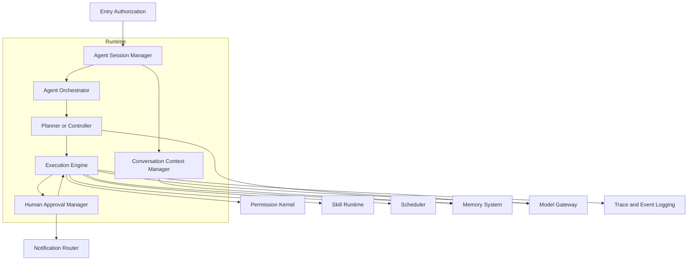

# Core Agent Runtime

```mermaid
flowchart TB
  EntryAuthorization["Entry Authorization"] --> SessionManager["Agent Session Manager"]

  subgraph Runtime
    SessionManager --> ContextManager["Conversation Context Manager"]
    SessionManager --> Orchestrator["Agent Orchestrator"]
    Orchestrator --> Planner["Planner or Controller"]
    Planner --> Executor["Execution Engine"]
    Executor --> HumanApproval["Human Approval Manager"]
    HumanApproval --> Executor
  end

  Executor --> PermissionKernel["Permission Kernel"]
  Executor --> SkillRuntime["Skill Runtime"]
  Executor --> Scheduler["Scheduler"]
  Executor --> Memory["Memory System"]
  Executor --> ModelGateway["Model Gateway"]
  Executor --> Observability["Trace and Event Logging"]

  ContextManager --> Memory
  Planner --> ModelGateway
  HumanApproval --> NotificationRouter["Notification Router"]
```
