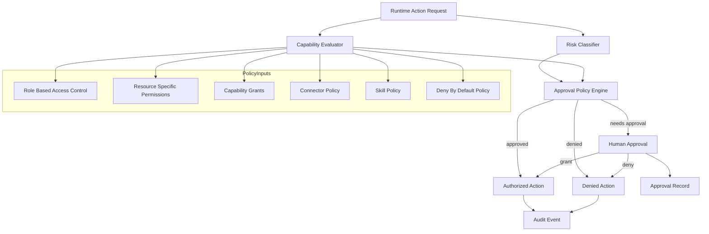

# Permission and Policy Kernel

```mermaid
flowchart TB
  Request["Runtime Action Request"] --> RiskClassifier["Risk Classifier"]
  Request --> CapabilityEvaluator["Capability Evaluator"]

  subgraph PolicyInputs
    RBAC["Role Based Access Control"]
    ResourcePermissions["Resource Specific Permissions"]
    CapabilityGrants["Capability Grants"]
    ConnectorPolicy["Connector Policy"]
    SkillPolicy["Skill Policy"]
    DefaultPolicy["Deny By Default Policy"]
  end

  CapabilityEvaluator --> RBAC
  CapabilityEvaluator --> ResourcePermissions
  CapabilityEvaluator --> CapabilityGrants
  CapabilityEvaluator --> ConnectorPolicy
  CapabilityEvaluator --> SkillPolicy
  CapabilityEvaluator --> DefaultPolicy

  RiskClassifier --> ApprovalPolicy["Approval Policy Engine"]
  CapabilityEvaluator --> ApprovalPolicy

  ApprovalPolicy -->|"approved"| Authorized["Authorized Action"]
  ApprovalPolicy -->|"needs approval"| HumanApproval["Human Approval"]
  ApprovalPolicy -->|"denied"| Denied["Denied Action"]

  HumanApproval -->|"grant"| Authorized
  HumanApproval -->|"deny"| Denied

  Authorized --> AuditEvent["Audit Event"]
  Denied --> AuditEvent
  HumanApproval --> ApprovalRecord["Approval Record"]
```
