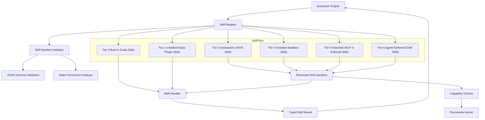

# Skill Runtime

```mermaid
flowchart TB
  Executor["Execution Engine"] --> SkillRegistry["Skill Registry"]

  SkillRegistry --> Validator["Skill Manifest Validator"]
  Validator --> SchemaValidation["JSON Schema Validation"]
  Validator --> PermissionAnalysis["Static Permission Analysis"]

  subgraph SkillTiers
    BuiltIn["Tier 0 Built In Scala Skills"]
    Plugin["Tier 1 Installed Scala Plugin Skills"]
    Declarative["Tier 2 Declarative JSON Skills"]
    Scripted["Tier 3 Scripted Sandbox Skills"]
    Imported["Tier 4 Imported MCP or External Skills"]
    Draft["Tier 5 Agent Authored Draft Skills"]
  end

  SkillRegistry --> BuiltIn
  SkillRegistry --> Plugin
  SkillRegistry --> Declarative
  SkillRegistry --> Scripted
  SkillRegistry --> Imported
  SkillRegistry --> Draft

  Declarative --> Sandbox["Restricted Skill Sandbox"]
  Scripted --> Sandbox
  Imported --> Sandbox
  Draft --> Sandbox

  Sandbox --> CapabilityChecks["Capability Checks"]
  CapabilityChecks --> PermissionKernel["Permission Kernel"]

  BuiltIn --> Handler["Skill Handler"]
  Plugin --> Handler
  Sandbox --> Handler

  Handler --> Result["Typed Skill Result"]
  Result --> Executor
```
