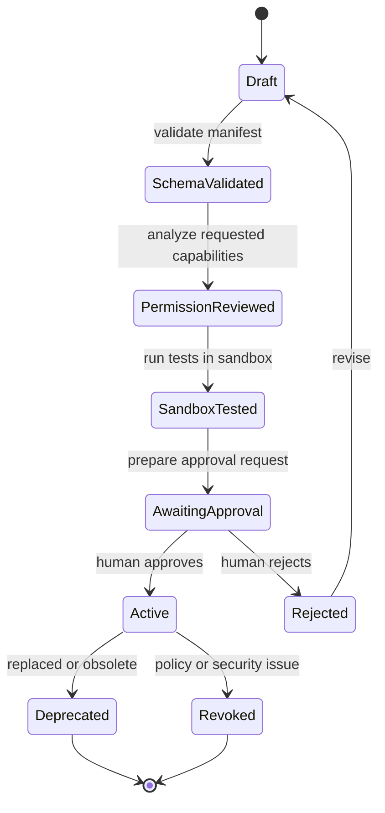
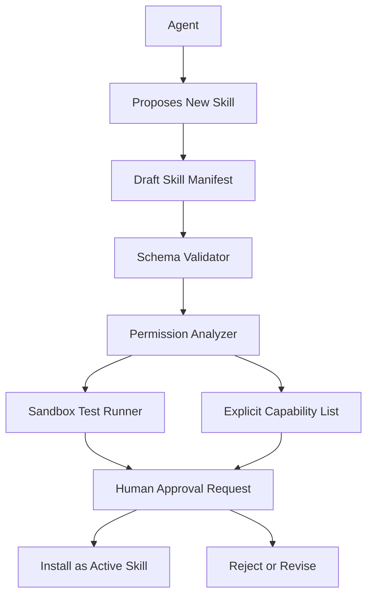

# Agent-Created Skill Lifecycle

```mermaid
stateDiagram-v2
  [*] --> Draft
  Draft --> SchemaValidated: validate manifest
  SchemaValidated --> PermissionReviewed: analyze requested capabilities
  PermissionReviewed --> SandboxTested: run tests in sandbox
  SandboxTested --> AwaitingApproval: prepare approval request
  AwaitingApproval --> Active: human approves
  AwaitingApproval --> Rejected: human rejects
  Active --> Deprecated: replaced or obsolete
  Active --> Revoked: policy or security issue
  Rejected --> Draft: revise
  Deprecated --> [*]
  Revoked --> [*]
```

```mermaid
flowchart TB
  Agent["Agent"] --> Proposal["Proposes New Skill"]
  Proposal --> DraftSkill["Draft Skill Manifest"]
  DraftSkill --> Validator["Schema Validator"]
  Validator --> PermissionAnalyzer["Permission Analyzer"]
  PermissionAnalyzer --> TestRunner["Sandbox Test Runner"]
  TestRunner --> ApprovalRequest["Human Approval Request"]
  ApprovalRequest --> Install["Install as Active Skill"]
  ApprovalRequest --> Reject["Reject or Revise"]

  PermissionAnalyzer --> CapabilityList["Explicit Capability List"]
  CapabilityList --> ApprovalRequest
```
