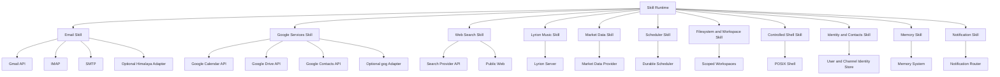

# Required Early Skills

```mermaid
flowchart TB
  SkillRuntime["Skill Runtime"] --> EmailSkill["Email Skill"]
  SkillRuntime --> GoogleSkill["Google Services Skill"]
  SkillRuntime --> WebSearchSkill["Web Search Skill"]
  SkillRuntime --> LyrionSkill["Lyrion Music Skill"]
  SkillRuntime --> MarketSkill["Market Data Skill"]
  SkillRuntime --> SchedulerSkill["Scheduler Skill"]
  SkillRuntime --> WorkspaceSkill["Filesystem and Workspace Skill"]
  SkillRuntime --> ShellSkill["Controlled Shell Skill"]
  SkillRuntime --> IdentitySkill["Identity and Contacts Skill"]
  SkillRuntime --> MemorySkill["Memory Skill"]
  SkillRuntime --> NotifySkill["Notification Skill"]

  EmailSkill --> Gmail["Gmail API"]
  EmailSkill --> IMAP["IMAP"]
  EmailSkill --> SMTP["SMTP"]
  EmailSkill --> Himalaya["Optional Himalaya Adapter"]

  GoogleSkill --> Calendar["Google Calendar API"]
  GoogleSkill --> Drive["Google Drive API"]
  GoogleSkill --> Contacts["Google Contacts API"]
  GoogleSkill --> Gog["Optional gog Adapter"]

  WebSearchSkill --> SearchAPI["Search Provider API"]
  WebSearchSkill --> PublicWeb["Public Web"]

  LyrionSkill --> Lyrion["Lyrion Server"]
  MarketSkill --> MarketAPI["Market Data Provider"]

  SchedulerSkill --> Scheduler["Durable Scheduler"]
  WorkspaceSkill --> Workspace["Scoped Workspaces"]
  ShellSkill --> POSIX["POSIX Shell"]
  IdentitySkill --> UserDirectory["User and Channel Identity Store"]
  MemorySkill --> MemorySystem["Memory System"]
  NotifySkill --> NotificationRouter["Notification Router"]
```
