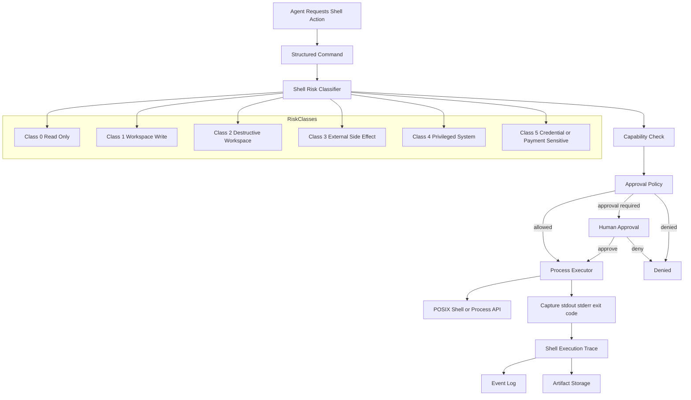
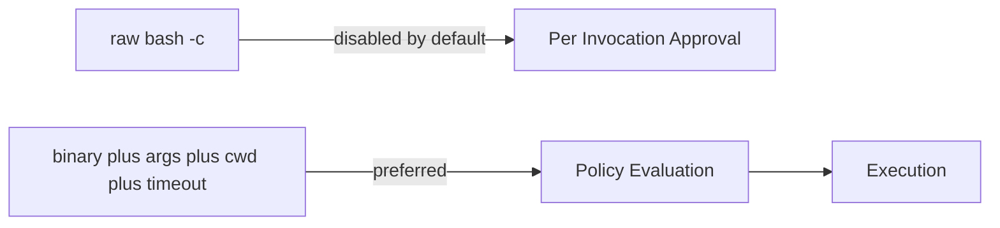

# Controlled Shell Access

```mermaid
flowchart TB
  AgentRequest["Agent Requests Shell Action"] --> StructuredCommand["Structured Command"]

  StructuredCommand --> RiskClassifier["Shell Risk Classifier"]

  subgraph RiskClasses
    Class0["Class 0 Read Only"]
    Class1["Class 1 Workspace Write"]
    Class2["Class 2 Destructive Workspace"]
    Class3["Class 3 External Side Effect"]
    Class4["Class 4 Privileged System"]
    Class5["Class 5 Credential or Payment Sensitive"]
  end

  RiskClassifier --> Class0
  RiskClassifier --> Class1
  RiskClassifier --> Class2
  RiskClassifier --> Class3
  RiskClassifier --> Class4
  RiskClassifier --> Class5

  RiskClassifier --> CapabilityCheck["Capability Check"]
  CapabilityCheck --> ApprovalPolicy["Approval Policy"]

  ApprovalPolicy -->|"allowed"| Executor["Process Executor"]
  ApprovalPolicy -->|"approval required"| HumanApproval["Human Approval"]
  ApprovalPolicy -->|"denied"| Denied["Denied"]

  HumanApproval -->|"approve"| Executor
  HumanApproval -->|"deny"| Denied

  Executor --> POSIX["POSIX Shell or Process API"]
  Executor --> Capture["Capture stdout stderr exit code"]
  Capture --> Trace["Shell Execution Trace"]
  Trace --> EventLog["Event Log"]
  Trace --> Artifacts["Artifact Storage"]
```

```mermaid
flowchart LR
  RawBash["raw bash -c"] -->|"disabled by default"| PerInvocationApproval["Per Invocation Approval"]
  Structured["binary plus args plus cwd plus timeout"] -->|"preferred"| PolicyEvaluation["Policy Evaluation"]
  PolicyEvaluation --> Execution["Execution"]
```
