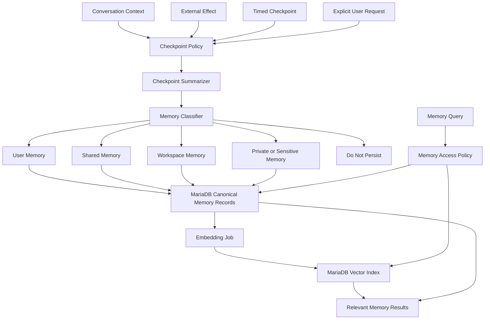

# Memory, Checkpointing, and Retrieval

```mermaid
flowchart TB
  Conversation["Conversation Context"] --> CheckpointPolicy["Checkpoint Policy"]
  ExternalEffect["External Effect"] --> CheckpointPolicy
  Timer["Timed Checkpoint"] --> CheckpointPolicy
  UserRequest["Explicit User Request"] --> CheckpointPolicy

  CheckpointPolicy --> Summarizer["Checkpoint Summarizer"]
  Summarizer --> Classifier["Memory Classifier"]

  Classifier --> UserMemory["User Memory"]
  Classifier --> SharedMemory["Shared Memory"]
  Classifier --> WorkspaceMemory["Workspace Memory"]
  Classifier --> PrivateMemory["Private or Sensitive Memory"]
  Classifier --> Discard["Do Not Persist"]

  UserMemory --> MariaDB["MariaDB Canonical Memory Records"]
  SharedMemory --> MariaDB
  WorkspaceMemory --> MariaDB
  PrivateMemory --> MariaDB

  MariaDB --> EmbeddingJob["Embedding Job"]
  EmbeddingJob --> VectorIndex["MariaDB Vector Index"]

  Query["Memory Query"] --> MemoryPolicy["Memory Access Policy"]
  MemoryPolicy --> MariaDB
  MemoryPolicy --> VectorIndex
  VectorIndex --> Results["Relevant Memory Results"]
  MariaDB --> Results
```
