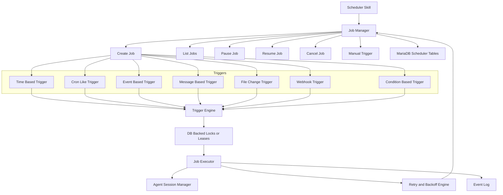

# Durable Scheduler and Triggers

```mermaid
flowchart TB
  SchedulerSkill["Scheduler Skill"] --> JobManager["Job Manager"]

  JobManager --> CreateJob["Create Job"]
  JobManager --> ListJobs["List Jobs"]
  JobManager --> PauseJob["Pause Job"]
  JobManager --> ResumeJob["Resume Job"]
  JobManager --> CancelJob["Cancel Job"]
  JobManager --> TriggerNow["Manual Trigger"]

  subgraph Triggers
    TimeTrigger["Time Based Trigger"]
    CronTrigger["Cron Like Trigger"]
    EventTrigger["Event Based Trigger"]
    MessageTrigger["Message Based Trigger"]
    FileTrigger["File Change Trigger"]
    WebhookTrigger["Webhook Trigger"]
    ConditionTrigger["Condition Based Trigger"]
  end

  CreateJob --> TimeTrigger
  CreateJob --> CronTrigger
  CreateJob --> EventTrigger
  CreateJob --> MessageTrigger
  CreateJob --> FileTrigger
  CreateJob --> WebhookTrigger
  CreateJob --> ConditionTrigger

  TimeTrigger --> TriggerEngine["Trigger Engine"]
  CronTrigger --> TriggerEngine
  EventTrigger --> TriggerEngine
  MessageTrigger --> TriggerEngine
  FileTrigger --> TriggerEngine
  WebhookTrigger --> TriggerEngine
  ConditionTrigger --> TriggerEngine

  TriggerEngine --> JobLocks["DB Backed Locks or Leases"]
  JobLocks --> Executor["Job Executor"]
  Executor --> AgentSession["Agent Session Manager"]

  Executor --> RetryEngine["Retry and Backoff Engine"]
  RetryEngine --> JobManager

  JobManager --> SchedulerTables["MariaDB Scheduler Tables"]
  Executor --> EventLog["Event Log"]
```
