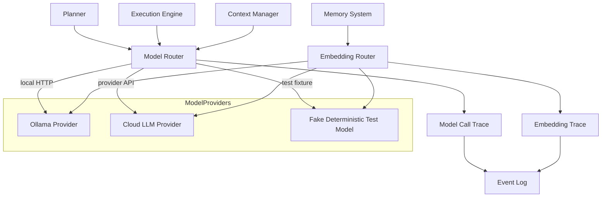
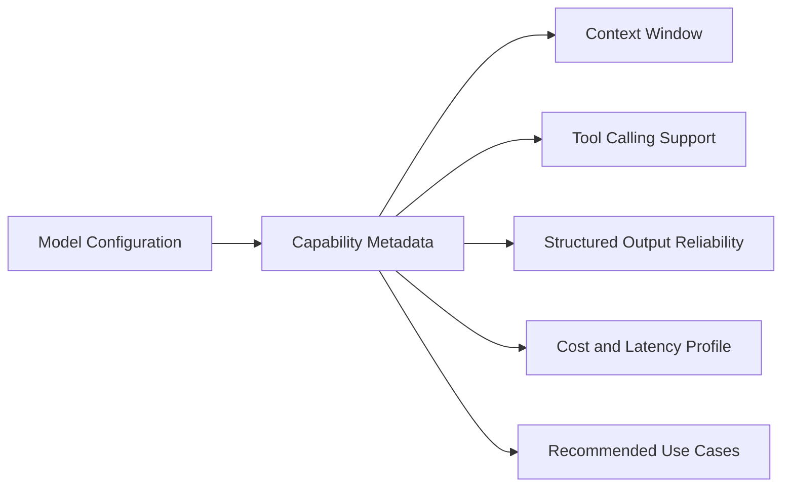

# Model Gateway

```mermaid
flowchart TB
  Planner["Planner"] --> ModelRouter["Model Router"]
  Executor["Execution Engine"] --> ModelRouter
  ContextManager["Context Manager"] --> ModelRouter
  MemorySystem["Memory System"] --> EmbeddingRouter["Embedding Router"]

  subgraph ModelProviders
    Ollama["Ollama Provider"]
    CloudLLM["Cloud LLM Provider"]
    FakeModel["Fake Deterministic Test Model"]
  end

  ModelRouter -->|"local HTTP"| Ollama
  ModelRouter -->|"provider API"| CloudLLM
  ModelRouter -->|"test fixture"| FakeModel

  EmbeddingRouter --> Ollama
  EmbeddingRouter --> CloudLLM
  EmbeddingRouter --> FakeModel

  ModelRouter --> ModelCallTrace["Model Call Trace"]
  EmbeddingRouter --> EmbeddingTrace["Embedding Trace"]

  ModelCallTrace --> EventLog["Event Log"]
  EmbeddingTrace --> EventLog
```

```mermaid
flowchart LR
  ModelConfig["Model Configuration"] --> Capabilities["Capability Metadata"]
  Capabilities --> ContextWindow["Context Window"]
  Capabilities --> ToolCalling["Tool Calling Support"]
  Capabilities --> JsonReliability["Structured Output Reliability"]
  Capabilities --> CostLatency["Cost and Latency Profile"]
  Capabilities --> UseCases["Recommended Use Cases"]
```
