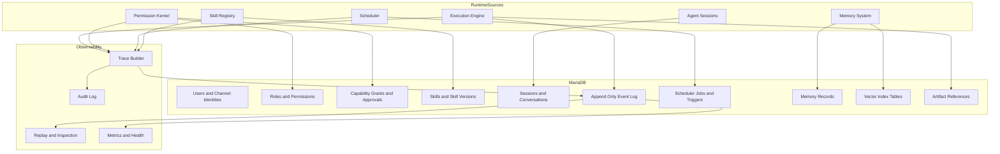

# Persistence and Observability

```mermaid
flowchart TB
  subgraph RuntimeSources
    SessionManager["Agent Sessions"]
    SkillRegistry["Skill Registry"]
    PermissionKernel["Permission Kernel"]
    Scheduler["Scheduler"]
    Memory["Memory System"]
    Executor["Execution Engine"]
  end

  subgraph MariaDB
    Users["Users and Channel Identities"]
    Roles["Roles and Permissions"]
    Grants["Capability Grants and Approvals"]
    Skills["Skills and Skill Versions"]
    Sessions["Sessions and Conversations"]
    Events["Append Only Event Log"]
    SchedulerTables["Scheduler Jobs and Triggers"]
    MemoryTables["Memory Records"]
    VectorTables["Vector Index Tables"]
    ArtifactRefs["Artifact References"]
  end

  SessionManager --> Sessions
  SkillRegistry --> Skills
  PermissionKernel --> Roles
  PermissionKernel --> Grants
  Scheduler --> SchedulerTables
  Memory --> MemoryTables
  Memory --> VectorTables
  Executor --> Events
  Executor --> ArtifactRefs

  subgraph Observability
    TraceBuilder["Trace Builder"]
    AuditLog["Audit Log"]
    Replay["Replay and Inspection"]
    Metrics["Metrics and Health"]
  end

  Executor --> TraceBuilder
  PermissionKernel --> TraceBuilder
  Scheduler --> TraceBuilder
  SkillRegistry --> TraceBuilder

  TraceBuilder --> Events
  TraceBuilder --> AuditLog
  Events --> Replay
  Events --> Metrics
```
