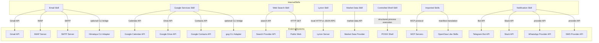

# External Systems and Connection Mechanisms

```mermaid
flowchart TB
  subgraph InternalSkills
    EmailSkill["Email Skill"]
    GoogleSkill["Google Services Skill"]
    WebSearchSkill["Web Search Skill"]
    LyrionSkill["Lyrion Skill"]
    MarketSkill["Market Data Skill"]
    ShellSkill["Controlled Shell Skill"]
    ImportedSkills["Imported Skills"]
    NotificationSkill["Notification Skill"]
  end

  subgraph ExternalSystems
    Gmail["Gmail API"]
    IMAP["IMAP Server"]
    SMTP["SMTP Server"]
    Himalaya["Himalaya CLI Adapter"]
    GoogleCalendar["Google Calendar API"]
    GoogleDrive["Google Drive API"]
    GoogleContacts["Google Contacts API"]
    Gog["gog CLI Adapter"]
    SearchProvider["Search Provider API"]
    PublicWeb["Public Web"]
    Lyrion["Lyrion Server"]
    MarketProvider["Market Data Provider"]
    Posix["POSIX Shell"]
    MCP["MCP Servers"]
    OpenClaw["OpenClaw Like Skills"]
    Telegram["Telegram Bot API"]
    Slack["Slack API"]
    WhatsApp["WhatsApp Provider API"]
    SMS["SMS Provider API"]
  end

  EmailSkill -->|"Gmail API"| Gmail
  EmailSkill -->|"IMAP"| IMAP
  EmailSkill -->|"SMTP"| SMTP
  EmailSkill -->|"optional CLI bridge"| Himalaya

  GoogleSkill -->|"Calendar API"| GoogleCalendar
  GoogleSkill -->|"Drive API"| GoogleDrive
  GoogleSkill -->|"Contacts API"| GoogleContacts
  GoogleSkill -->|"optional CLI bridge"| Gog

  WebSearchSkill -->|"search API"| SearchProvider
  WebSearchSkill -->|"HTTP GET"| PublicWeb

  LyrionSkill -->|"local HTTP or JSON RPC"| Lyrion
  MarketSkill -->|"market data API"| MarketProvider
  ShellSkill -->|"structured process execution"| Posix

  ImportedSkills -->|"MCP protocol"| MCP
  ImportedSkills -->|"manifest translation"| OpenClaw

  NotificationSkill -->|"Bot API"| Telegram
  NotificationSkill -->|"Slack API"| Slack
  NotificationSkill -->|"provider API"| WhatsApp
  NotificationSkill -->|"provider API"| SMS
```
