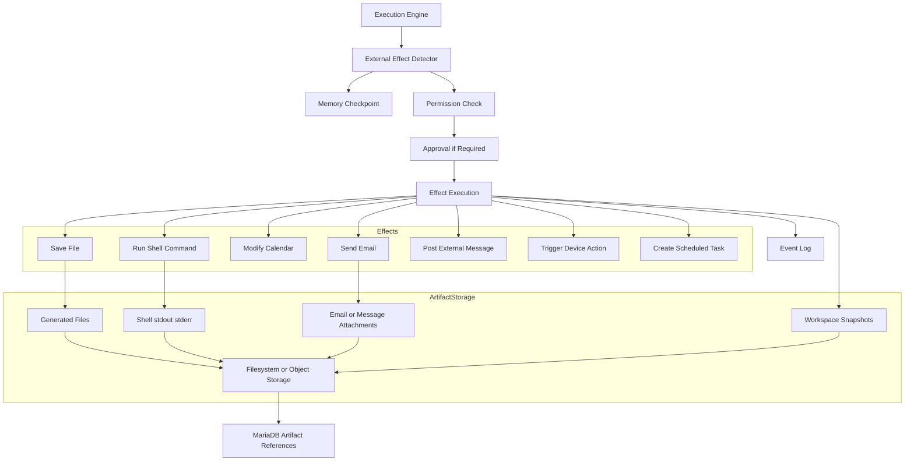

# Artifacts and External Effects

```mermaid
flowchart TB
  Executor["Execution Engine"] --> EffectDetector["External Effect Detector"]
  EffectDetector --> Checkpoint["Memory Checkpoint"]
  EffectDetector --> PermissionCheck["Permission Check"]
  PermissionCheck --> Approval["Approval if Required"]
  Approval --> EffectExecution["Effect Execution"]

  subgraph Effects
    SaveFile["Save File"]
    SendEmail["Send Email"]
    ModifyCalendar["Modify Calendar"]
    RunShell["Run Shell Command"]
    PostMessage["Post External Message"]
    TriggerDevice["Trigger Device Action"]
    CreateSchedule["Create Scheduled Task"]
  end

  EffectExecution --> SaveFile
  EffectExecution --> SendEmail
  EffectExecution --> ModifyCalendar
  EffectExecution --> RunShell
  EffectExecution --> PostMessage
  EffectExecution --> TriggerDevice
  EffectExecution --> CreateSchedule

  subgraph ArtifactStorage
    ArtifactStore["Filesystem or Object Storage"]
    StdoutStderr["Shell stdout stderr"]
    Attachments["Email or Message Attachments"]
    GeneratedFiles["Generated Files"]
    Snapshots["Workspace Snapshots"]
  end

  SaveFile --> GeneratedFiles
  RunShell --> StdoutStderr
  SendEmail --> Attachments
  EffectExecution --> Snapshots

  GeneratedFiles --> ArtifactStore
  StdoutStderr --> ArtifactStore
  Attachments --> ArtifactStore
  Snapshots --> ArtifactStore

  ArtifactStore --> ArtifactRefs["MariaDB Artifact References"]
  EffectExecution --> EventLog["Event Log"]
```
