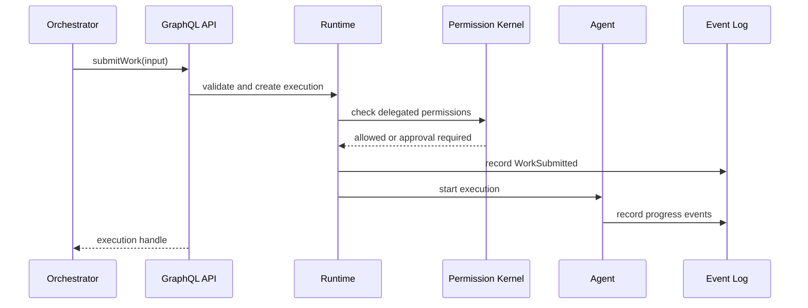
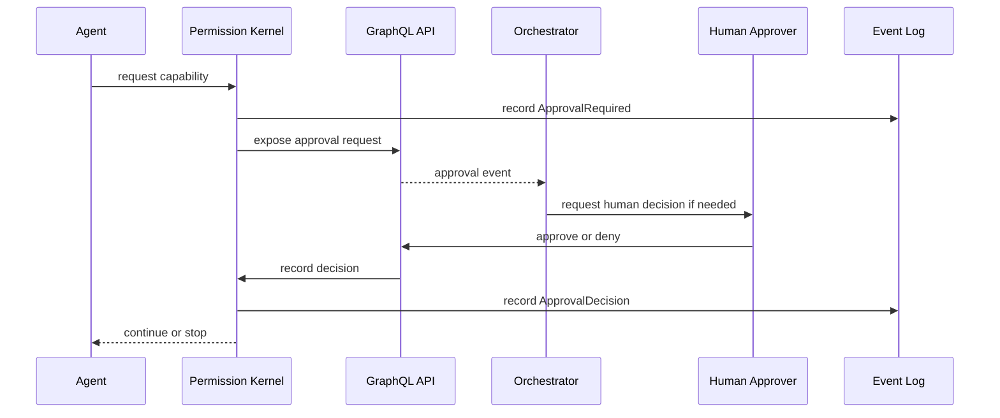
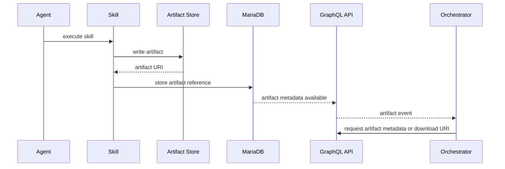

# Addendum: Orchestrator Integration Interface
## Secure Agent Runtime and Orchestration Platform

Version: 0.1 Draft  
Date: 2026-05-24  
Related Documents:
- Software Requirements Specification
- Software Design Description

---

# 1. Purpose

This addendum describes how the Secure Agent Runtime should support external orchestrators, such as Paperclip or similar AI project-management and automation systems.

The goal is to make this runtime easier, safer, and more predictable for orchestrators to use than directly controlling general-purpose chat agents or loosely structured tools such as Claude desktop workflows, OpenClaw-style agents, or ad-hoc shell automation.

The runtime should expose a stable orchestration interface that allows external systems to:

- Discover capabilities
- Submit work
- Inspect progress
- Manage approvals
- Query traces
- Retrieve artifacts
- Subscribe to events
- Resume or cancel work
- Understand permission requirements before execution
- Coordinate with multiple users and communication channels

The central design principle is:

> External orchestrators should interact with the agent runtime through structured contracts, not through prompt guessing.

---

# 2. Problem Statement

Current orchestrators often communicate with AI agents in haphazard ways:

- Sending natural-language prompts into chat interfaces
- Scraping text responses
- Calling tools indirectly through model behavior
- Guessing whether a task succeeded
- Lacking structured progress state
- Lacking reliable artifact references
- Lacking permission introspection
- Lacking deterministic approval workflows
- Lacking durable traceability

This creates fragile integrations.

An orchestrator should not need to know how to prompt an agent into using a tool. It should be able to call the runtime as an automation platform with clearly defined APIs, states, schemas, and events.

---

# 3. Design Goal

The agent runtime should support an **Orchestrator Integration Interface**.

This interface should allow an external orchestrator to treat the runtime as a secure worker system capable of:

- Performing AI-assisted tasks
- Running skills
- Executing workflows
- Scheduling work
- Producing inspectable artifacts
- Requesting human approval when required
- Returning machine-readable state

The orchestrator should be able to use the runtime without depending on internal implementation details.

---

# 4. Recommended Integration Strategy

## 4.1 GraphQL as Primary Control Plane

GraphQL should be the primary orchestration control plane.

GraphQL is a good fit because orchestrators need to:

- Query nested state
- Retrieve partial progress
- Inspect task metadata
- Subscribe to updates
- Submit structured commands
- Discover available capabilities
- Request only the fields they need

The runtime should expose a GraphQL API using Caliban.

GraphQL should support:

- Queries
- Mutations
- Subscriptions
- Strongly typed schemas
- Introspection
- Versioned API evolution where needed

---

## 4.2 Event Stream for Runtime Updates

GraphQL subscriptions should expose real-time or near-real-time runtime events.

The orchestrator should not need to poll constantly.

Events should include:

- Task accepted
- Task started
- Agent message emitted
- Tool call proposed
- Tool call started
- Tool call completed
- Approval required
- Approval granted
- Approval denied
- Artifact created
- Task checkpointed
- Task failed
- Task completed
- Task cancelled
- Scheduler trigger fired

---

## 4.3 Optional REST or Webhook Compatibility

Although GraphQL should be the primary control plane, the system may also expose limited REST or webhook interfaces for simpler integrations.

REST/webhook support should be secondary and should not replace the richer GraphQL API.

Recommended use cases:

- Incoming webhooks
- Simple task submission
- External event triggers
- Health checks
- Artifact download URLs

---

## 4.4 MCP Compatibility

The runtime may expose an MCP-compatible facade in the future.

However, MCP should not be the primary internal orchestration protocol.

MCP is useful for tool interoperability, but the runtime needs richer concepts than typical tool invocation:

- Users
- Roles
- Permissions
- Approvals
- Scheduler state
- Memory checkpoints
- Event traces
- Artifacts
- Replay
- Long-running task control

Therefore:

> MCP should be treated as a compatibility layer, while GraphQL should serve as the primary orchestration API.

---

# 5. Core Orchestrator Concepts

## 5.1 Orchestrator

An orchestrator is an external system that submits and supervises work.

Examples:

- Paperclip
- A project-management AI
- A CI/CD system
- A custom automation dashboard
- A human-facing operations console
- Another agent system

The runtime should identify orchestrators distinctly from human users.

---

## 5.2 Orchestrator Identity

The system should support first-class orchestrator identities.

An orchestrator identity should have:

- ID
- Name
- Authentication credentials
- Allowed users or organizations
- Allowed workspaces
- Allowed capabilities
- Rate limits
- Default approval policies
- Audit metadata

An orchestrator should not impersonate arbitrary users without an explicit delegation model.

---

## 5.3 Delegated User Context

Many orchestrator-submitted tasks will be performed on behalf of a user.

The API should distinguish:

- The orchestrator submitting the task
- The user on whose behalf the task runs
- The agent assigned to execute the task
- The workspace or project context

Example:

```text
submittedBy: paperclip
onBehalfOf: roberto
workspace: bespoke-draft
agent: coding-agent
```

This distinction is critical for auditability and permission enforcement.

---

## 5.4 Work Request

A work request is a structured task submitted by an orchestrator.

A work request should include:

- Title
- Goal
- User context
- Workspace context
- Constraints
- Required outputs
- Allowed capabilities
- Disallowed actions
- Deadline or priority
- Approval preferences
- Expected artifact types
- Success criteria
- Callback or subscription preferences

---

## 5.5 Execution Handle

When a work request is accepted, the runtime should return an execution handle.

The handle should allow the orchestrator to:

- Query status
- Subscribe to events
- Cancel execution
- Pause execution
- Resume execution
- Submit additional guidance
- Respond to approval requests
- Retrieve artifacts
- Retrieve trace data

---

# 6. GraphQL API Areas

The GraphQL API should expose the following major areas.

## 6.1 Capability Discovery

Orchestrators should be able to discover what the runtime can do.

Example capabilities:

- Available skills
- Available connectors
- Available models
- Available workspaces
- Permission requirements
- Required approvals
- Input and output schemas

Example conceptual queries:

```graphql
query {
  skills {
    id
    name
    version
    description
    inputSchema
    outputSchema
    requiredCapabilities
    trustLevel
  }
}
```

```graphql
query {
  capabilities {
    name
    description
    supportedScopes
    defaultApprovalMode
    riskClass
  }
}
```

---

## 6.2 Work Submission

The orchestrator should submit work through a structured mutation.

Example conceptual mutation:

```graphql
mutation SubmitWork($input: SubmitWorkInput!) {
  submitWork(input: $input) {
    executionId
    status
    requiredApprovals {
      id
      capability
      scope
      reason
    }
  }
}
```

The runtime should validate the work request before accepting it.

Validation should include:

- User identity
- Orchestrator identity
- Workspace access
- Requested capability scope
- Required skills
- Required connectors
- Resource availability
- Policy compliance

---

## 6.3 Execution Inspection

The orchestrator should be able to query execution status.

Example conceptual query:

```graphql
query Execution($id: ID!) {
  execution(id: $id) {
    id
    status
    goal
    currentStep
    startedAt
    updatedAt
    submittedBy {
      id
      name
    }
    onBehalfOf {
      id
      displayName
    }
    events(limit: 50) {
      timestamp
      type
      summary
    }
    artifacts {
      id
      name
      mediaType
      uri
    }
  }
}
```

---

## 6.4 Event Subscriptions

The orchestrator should subscribe to execution events.

Example conceptual subscription:

```graphql
subscription ExecutionEvents($executionId: ID!) {
  executionEvents(executionId: $executionId) {
    timestamp
    type
    severity
    summary
    payload
  }
}
```

---

## 6.5 Approval Handling

The orchestrator should be able to see approval requests.

Depending on policy, the orchestrator may or may not be authorized to approve them.

Example conceptual mutation:

```graphql
mutation Approve($input: ApprovalDecisionInput!) {
  decideApproval(input: $input) {
    approvalId
    decision
    effectiveScope
    expiresAt
  }
}
```

Approval decision authority should be governed by the permission kernel.

Some approvals may require a human user even when submitted by an orchestrator.

---

## 6.6 Artifact Access

The orchestrator should be able to retrieve generated artifacts.

Artifacts may include:

- Files
- Logs
- Patches
- Reports
- Email drafts
- Calendar changes
- Execution transcripts
- Shell output
- Test results

Artifact access should be permission-controlled.

---

## 6.7 Scheduler Integration

The orchestrator should be able to create and manage scheduled work.

Example capabilities:

- Create scheduled work
- List scheduled work
- Pause schedule
- Resume schedule
- Cancel schedule
- Trigger scheduled work manually
- Subscribe to schedule execution events

---

## 6.8 Memory and Context Access

The orchestrator may need to provide or retrieve context.

The runtime should support controlled access to:

- User context
- Workspace context
- Shared memory
- Task-specific memory
- Prior execution summaries

Memory access must be policy-governed to avoid cross-user leakage.

---

# 7. Orchestrator-Friendly Workflows

## 7.1 Task Submission Flow



---

## 7.2 Approval Flow



---

## 7.3 Artifact Flow



---

# 8. API Design Principles

## 8.1 Structured Inputs

The orchestrator should never need to rely only on natural-language prompts.

Work submission should support structured fields:

- Goal
- Constraints
- Context
- Allowed operations
- Required outputs
- Acceptance criteria
- Approval behavior

Natural language may still be included, but it should not be the only control mechanism.

---

## 8.2 Machine-Readable Outputs

The runtime should return machine-readable status and results.

Each execution should produce:

- Status
- Events
- Artifacts
- Final summary
- Structured result where applicable
- Error classification
- Approval history
- Capability usage history

---

## 8.3 Stable State Machine

Executions should have a stable state machine.

Recommended states:

```text
created
accepted
waiting_for_approval
running
paused
blocked
completed
failed
cancelled
expired
```

This allows orchestrators to reason about work without parsing free-form text.

---

## 8.4 Explicit Error Types

The runtime should expose structured error categories.

Examples:

- validation_failed
- permission_denied
- approval_required
- approval_denied
- model_error
- skill_error
- connector_error
- timeout
- cancelled
- policy_violation
- unavailable_resource
- invalid_state
- unknown_error

---

## 8.5 Idempotency

Mutations that create work or external effects should support idempotency keys.

This prevents duplicate tasks or repeated side effects when orchestrators retry requests.

---

## 8.6 Correlation IDs

All orchestrator-submitted work should support correlation IDs.

Correlation IDs should appear in:

- Event logs
- Execution records
- Approval requests
- Artifacts
- Scheduler jobs
- Trace exports

---

## 8.7 Dry-Run and Planning Modes

The API should support non-executing plan requests.

An orchestrator should be able to ask:

- What would you do?
- What permissions would this require?
- What skills would be used?
- What external effects might occur?
- What approvals would be needed?
- What artifacts would be produced?

This is especially useful before allowing autonomous execution.

---

# 9. Security and Trust Model

## 9.1 Orchestrator Permissions

Orchestrators should not automatically have broad authority.

An orchestrator should have its own permission profile.

It may be allowed to:

- Submit tasks
- Read execution state
- Read artifacts
- Create scheduled tasks
- Approve low-risk actions
- Request human approval for high-risk actions

It may be forbidden from:

- Approving its own high-risk actions
- Accessing private user memory
- Running unrestricted shell commands
- Sending external communications without approval
- Creating persistent capabilities

---

## 9.2 Delegation

The runtime should distinguish between:

- Orchestrator authority
- User authority
- Agent authority
- Skill authority

A task submitted by Paperclip on behalf of Roberto should not automatically receive all of Roberto's authority unless Roberto has delegated that authority.

---

## 9.3 Approval Boundary

Some approvals may be delegated to orchestrators.

Other approvals should require a human.

Recommended defaults:

| Action | Orchestrator Approval? | Human Approval? |
|---|---:|---:|
| Read execution status | Yes | No |
| Read allowed workspace files | Maybe | Maybe once |
| Create low-risk task | Yes | No |
| Run read-only shell command | Maybe | Configurable |
| Delete files | No | Yes |
| Send email | No | Yes |
| Purchase something | No | Yes |
| Access secrets | No | Yes |
| Create persistent permission | No | Yes |

---

# 10. Orchestrator Manifest

The runtime should support registration of orchestrators through a manifest.

Example conceptual manifest:

```json
{
  "id": "paperclip-local",
  "name": "Paperclip Local Orchestrator",
  "type": "orchestrator",
  "auth": {
    "method": "api_key"
  },
  "allowedUsers": ["roberto"],
  "allowedWorkspaces": ["bespoke-draft", "dmscreen"],
  "allowedCapabilities": [
    {
      "capability": "execution.submit",
      "scope": "workspace",
      "approval": "persistent"
    },
    {
      "capability": "execution.read",
      "scope": "own_submissions",
      "approval": "persistent"
    },
    {
      "capability": "artifact.read",
      "scope": "own_submissions",
      "approval": "persistent"
    }
  ],
  "defaultApprovalBehavior": {
    "highRisk": "human_required",
    "externalEffects": "human_required"
  },
  "rateLimits": {
    "submittedWorkPerHour": 20
  }
}
```

---

# 11. Work Request Schema

The runtime should define a structured work request schema.

Example conceptual input:

```json
{
  "submittedBy": "paperclip-local",
  "onBehalfOf": "roberto",
  "workspace": "bespoke-draft",
  "title": "Implement measurement import",
  "goal": "Add support for importing client measurements from CSV.",
  "constraints": [
    "Use Scala 3",
    "Do not modify database schema without approval",
    "Do not push to git remote"
  ],
  "allowedCapabilities": [
    "workspace.read",
    "workspace.write",
    "shell.binary.execute"
  ],
  "disallowedCapabilities": [
    "git.push",
    "filesystem.delete",
    "email.send"
  ],
  "expectedArtifacts": [
    "patch",
    "test-results",
    "summary"
  ],
  "successCriteria": [
    "Unit tests pass",
    "CSV import has validation",
    "Existing measurement workflows still compile"
  ],
  "approvalPreference": "ask_when_required",
  "idempotencyKey": "paperclip-2026-05-24-001"
}
```

---

# 12. Trace Export

External orchestrators should be able to retrieve execution traces.

Trace exports should support:

- Full trace
- Redacted trace
- Summary trace
- Machine-readable JSON
- Human-readable Markdown
- Artifact references
- Permission decision history
- Model call summaries
- Tool call summaries

This is important for debugging and for orchestrators that maintain their own project history.

---

# 13. Relationship to Existing Interfaces

## 13.1 Difference from Chat Interface

A chat interface is user-facing.

The orchestrator interface is machine-facing.

The orchestrator interface should avoid relying on:

- Prompt phrasing
- Free-form model responses
- Hidden tool calls
- Screen scraping
- Chat transcript parsing

---

## 13.2 Difference from OpenClaw-Style Usage

OpenClaw-style systems often expose behavior through open-ended skills, filesystem conventions, or direct agent prompting.

This runtime should expose:

- Structured capabilities
- Schema-validated skills
- Inspectable execution
- Durable state
- Explicit approval workflows
- Typed API contracts

---

## 13.3 Difference from Claude Desktop Usage

Claude Desktop-like usage is primarily interactive.

This runtime should support:

- Long-running tasks
- Scheduled tasks
- Reconnectable execution
- External orchestrator control
- Event subscription
- Artifact retrieval
- Role-based permissioning

---

# 14. Requirements Addendum

The SRS should be amended with the following requirements.

## 14.1 Orchestrator Integration

The system shall provide a machine-oriented orchestration interface.

## 14.2 GraphQL Control Plane

The system shall expose GraphQL queries, mutations, and subscriptions for orchestrator integration.

## 14.3 Work Submission

The system shall allow external orchestrators to submit structured work requests.

## 14.4 Execution Handles

The system shall return execution handles for submitted work.

## 14.5 Execution State Query

The system shall allow orchestrators to query execution state.

## 14.6 Event Subscription

The system shall allow orchestrators to subscribe to execution events.

## 14.7 Capability Discovery

The system shall allow orchestrators to discover available skills, connectors, capabilities, schemas, and permission requirements.

## 14.8 Approval Integration

The system shall expose approval requests and decisions through the orchestration API.

## 14.9 Delegated Execution

The system shall distinguish between the submitting orchestrator and the user on whose behalf work is performed.

## 14.10 Idempotency

The system shall support idempotency keys for orchestrator-submitted mutations.

## 14.11 Trace Export

The system shall allow orchestrators to retrieve trace exports.

## 14.12 Dry-Run Mode

The system shall support dry-run or planning mode to estimate required capabilities and likely effects before execution.

---

# 15. Design Addendum

The SDD should be amended with the following design elements.

## 15.1 Orchestrator Identity Model

Add first-class orchestrator identities alongside users, agents, connectors, and service accounts.

## 15.2 Orchestrator API Layer

Add an Orchestrator API area within the GraphQL schema.

## 15.3 Work Request Domain Model

Add a structured work request domain model.

## 15.4 Execution State Machine

Add a stable execution state machine suitable for machine supervision.

## 15.5 Event Subscription Model

Add a subscription event model for external orchestrators.

## 15.6 Approval Delegation Policy

Extend the permission kernel to distinguish human approval, orchestrator approval, and system-policy approval.

## 15.7 Trace Export Service

Add a trace export service that can produce redacted and full traces.

## 15.8 Idempotent Mutation Handling

Add idempotency key handling for task creation, schedule creation, and external-effect requests.

---

# 16. Validation Against Project Goals

This addendum reinforces the original project goals.

| Goal | Support Provided |
|---|---|
| Safer than OpenClaw-style systems | Structured permissions, approvals, delegation |
| Easier for orchestrators than chat agents | GraphQL API, execution handles, event subscriptions |
| More debuggable | Trace export, event log access, structured errors |
| More maintainable | Typed work requests and stable state machine |
| Multi-user from day one | Delegated user context and orchestrator identity |
| Better for automation | Scheduler, idempotency, dry-run planning |
| Less haphazard integration | Capability discovery and schemas |

---

# 17. Recommendation

This addendum should be adopted.

The orchestrator integration interface should be considered a first-class system capability, not an afterthought.

GraphQL should serve as the primary control plane for external orchestrators, while internal connectors may continue to use shared application services directly.

The runtime should aim to become an automation substrate that orchestrators can depend on, rather than another chat-oriented agent that requires fragile prompt engineering.
